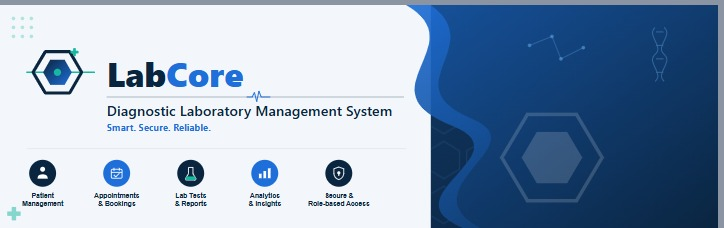
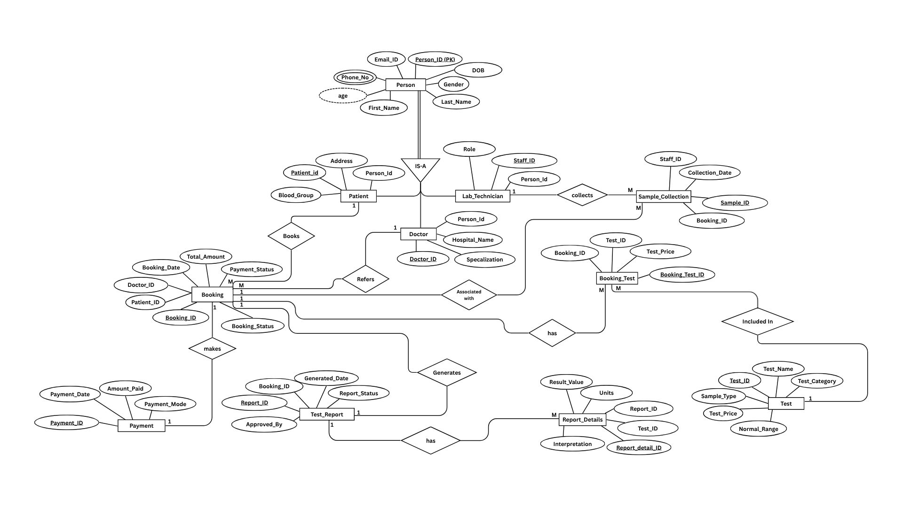
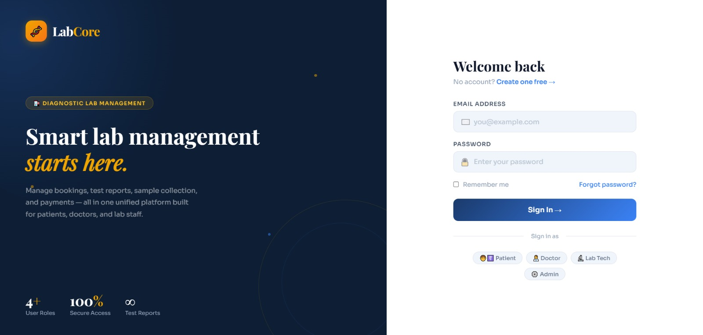
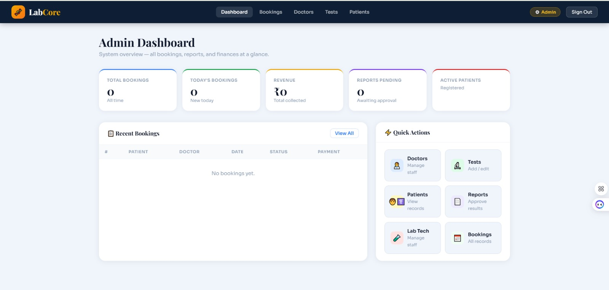
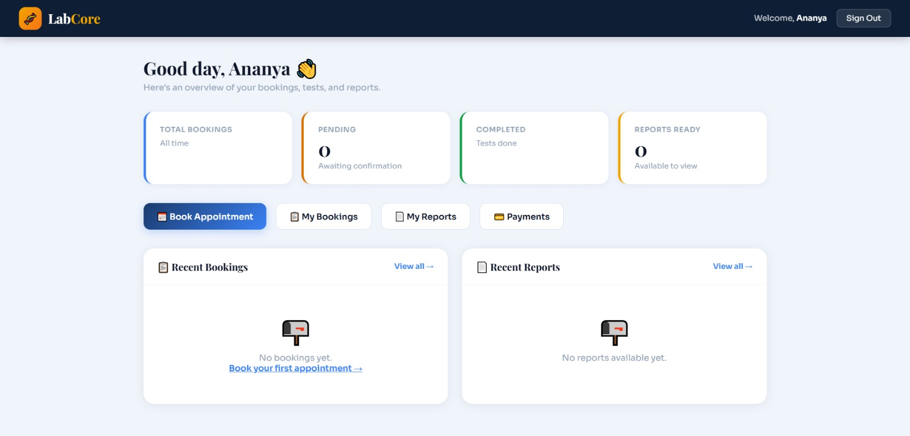
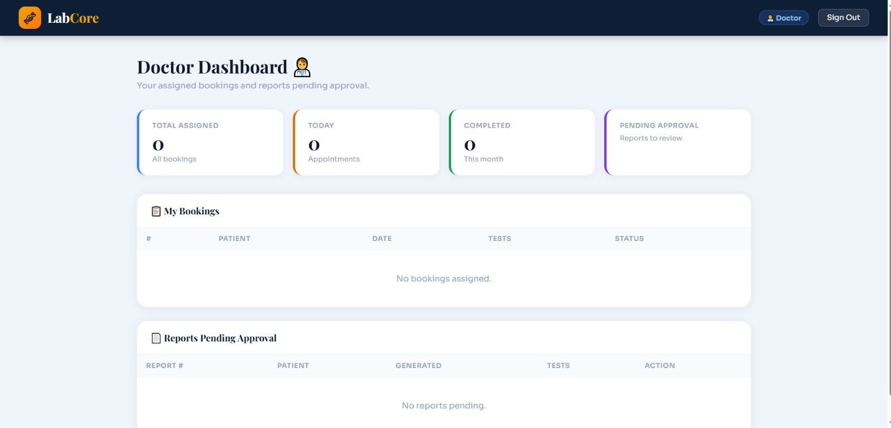
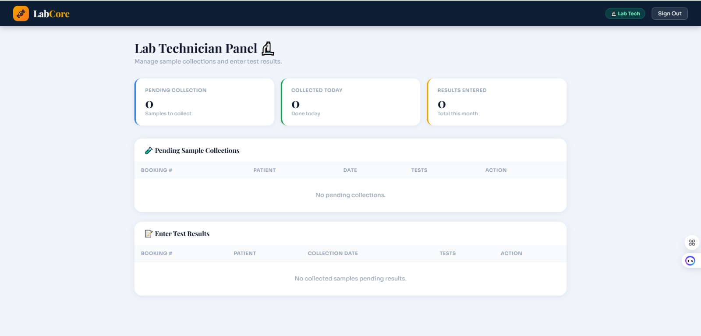

<p align="center">
  
</p>

<p align="center">
  
</p>

<h1 align="center">🧪 LabCore</h1>

<h3 align="center">
Diagnostic Laboratory Management System
</h3>

<p align="center">
A modern role-based Laboratory Management System built using <b>PHP</b>, <b>MySQL</b>, <b>HTML</b>, <b>CSS</b>, and <b>JavaScript</b>.
</p>

<p align="center">
Developed by <b>Riddhi Bhoite</b> & <b>Siddhi Bhoite</b>
</p>

---

# 📑 Table of Contents

- 📖 Overview
- 🎯 Project Objective
- 🗂️ Entity Relationship Diagram
- ✨ Features
- 📸 Project Screenshots
- 🚀 Technology Stack
- 📂 Project Structure
- 📁 Folder Description
- 🔄 System Workflow
- 🗄️ Database Design
- 🔐 Authentication
- 🔑 Demo Credentials
- ⚙️ Installation Guide
- 🌟 Project Highlights
- 🔮 Future Enhancements
- 🤝 Contributing
- 👩‍💻 Developers
- 📄 License

---

# 📖 Overview

LabCore is a role-based web application developed to simplify and digitize the complete workflow of a diagnostic laboratory. The system enables secure management of patients, doctors, laboratory technicians, appointments, diagnostic reports, payments, and administrative operations through a centralized platform.

The project was collaboratively developed as part of a **Database Management System (DBMS)** academic project while following normalized database design principles and secure role-based authentication.

---

# 🎯 Project Objective

The objective of LabCore is to provide a centralized platform for efficiently managing laboratory operations. It minimizes manual paperwork by digitizing patient registration, appointment scheduling, laboratory testing, report generation, and administrative management while ensuring secure role-based access for different users.

---

# 🗂️ Entity Relationship (ER) Diagram

The database follows a normalized relational design to ensure data integrity, reduce redundancy, and efficiently manage laboratory operations.



---

## 🗄️ Database Highlights

- Fully normalized relational database
- Centralized **Person** table for role-based user management
- Foreign key constraints ensure data integrity
- Separate entities for Patients, Doctors, and Lab Technicians
- Supports appointments, payments, sample collection, and report generation
- Efficient relational mapping between all modules

---

# ✨ Features

## 👤 Patient Module

- Secure Registration & Login
- Book Laboratory Tests
- Appointment Management
- View Booking History
- Online Payment Management
- View Laboratory Reports

---

## 👨‍⚕️ Doctor Module

- Secure Login
- View Assigned Patients
- Review Laboratory Reports
- Approve Diagnostic Reports

---

## 🧪 Lab Technician Module

- Secure Login
- Sample Collection
- Enter Laboratory Test Results
- Generate Reports

---

## ⚙️ Admin Module

- Dashboard Analytics
- Manage Patients
- Manage Doctors
- Manage Lab Technicians
- Manage Laboratory Tests
- Manage Bookings
- Approve Reports
- Monitor Revenue & Laboratory Statistics

---

# 📸 Project Screenshots

## Login Page



---

## Admin Dashboard



---

## Patient Dashboard



---

## Doctor Dashboard



---

## Lab Technician Dashboard



---

# 🚀 Technology Stack

| Category | Technologies |
|-----------|--------------|
| Frontend | HTML5, CSS3, JavaScript |
| Backend | PHP |
| Database | MySQL |
| Web Server | Apache (XAMPP) |
| Authentication | PHP Sessions & Bcrypt Password Hashing |
| Version Control | Git & GitHub |

---

# 📂 Project Structure

```
LabCore-Diagnostic-Lab-Management-System/
│
├── api/
├── assets/
│   ├── css/
│   ├── js/
│   └── images/
│
├── includes/
│   ├── db.php
│   └── helpers.php
│
├── pages/
│
├── database/
│   └── lab_management.sql
│
├── screenshots/
│
├── README.md
├── .gitignore
└── index.php
```

---

# 📁 Folder Description

| Folder | Description |
|----------|-------------|
| **api/** | Backend PHP API endpoints |
| **assets/** | CSS, JavaScript, Fonts & Images |
| **includes/** | Database connection and helper functions |
| **pages/** | User Interface pages |
| **database/** | SQL database schema |
| **screenshots/** | Project screenshots |
| **README.md** | Project documentation |

---

# 🔄 System Workflow

```text
Patient
   │
   ▼
Register / Login
   │
   ▼
Book Appointment
   │
   ▼
Payment
   │
   ▼
Sample Collection
   │
   ▼
Laboratory Test
   │
   ▼
Result Entry
   │
   ▼
Doctor Approval
   │
   ▼
Report Generation
```

---

# 🗄️ Database Design

The project follows a normalized relational database model designed to minimize redundancy while maintaining referential integrity.

## Main Tables

- Person
- Patient
- Doctor
- Lab_Technician
- Test
- Booking
- Booking_Test
- Payment
- Sample_Collection
- Test_Report
- Report_Details

---

## Entity Relationships

```text
Person
├── Patient
├── Doctor
└── Lab_Technician

Patient
│
Booking
│
├── Booking_Test
│       │
│       Test
│
├── Payment
│
└── Sample_Collection
        │
        Test_Report
              │
        Report_Details
```

---

# 🔐 Authentication

The application supports secure role-based authentication.

### Available Roles

- 👨‍💼 Administrator
- 👨‍⚕️ Doctor
- 🧪 Lab Technician
- 👤 Patient

Passwords are securely stored using **bcrypt hashing**.

---

# 🔑 Demo Login Credentials

| Role | Email | Password |
|------|-------|----------|
| 👨‍💼 Admin | admin@labcore.com | Admin@123 |
| 👨‍⚕️ Doctor | doctor@labcore.com | Doctor@123 |
| 🧪 Lab Technician | technician@labcore.com | Tech@123 |
| 👤 Patient | patient@labcore.com | Patient@123 |

> **Note:** These demo accounts are provided for testing and evaluation purposes only.

---

# ⚙️ Installation Guide

## Requirements

- PHP 8+
- MySQL
- XAMPP
- Modern Web Browser

---

### 1. Clone the Repository

```bash
git clone https://github.com/riddhi-bhoite/LabCore-Diagnostic-Lab-Management-System.git
```

---

### 2. Copy the Project

Move the project into the **htdocs** directory of XAMPP.

```text
xampp/htdocs/
```

---

### 3. Import the Database

Import:

```text
database/lab_management.sql
```

using **phpMyAdmin**.

---

### 4. Configure Database

Update your database credentials in:

```text
includes/db.php
```

---

### 5. Start XAMPP

Start:

- Apache
- MySQL

---

### 6. Run the Application

Open:

```text
http://localhost/LabManagement/
```

---

# 🌟 Project Highlights

- Multi-role Authentication System
- Secure Password Hashing
- Appointment Booking Workflow
- Laboratory Test Management
- Report Approval Workflow
- Dashboard Analytics
- REST-style PHP APIs
- Normalized Relational Database
- Responsive User Interface

---

# 🔮 Future Enhancements

- Email Notifications
- SMS Appointment Reminders
- PDF Report Downloads
- QR Code-based Sample Tracking
- Online Payment Gateway
- Advanced Search & Filtering
- Data Visualization Dashboard
- Mobile Responsive Design
- Audit Logs
- Email Verification

---

# 🤝 Contributing

This project was developed for academic and portfolio purposes.

Suggestions, improvements, and constructive feedback are always welcome.

---

# 👩‍💻 Developers

This project was collaboratively designed and developed by:

- **Riddhi Bhoite**
- **Siddhi Bhoite**

As part of the **Database Management System (DBMS)** academic project.

---

# 📄 License

This project is shared for educational and portfolio purposes.

You are welcome to explore the source code and learn from it. If you use significant portions of this work, please provide appropriate attribution.

---

<p align="center">
⭐ If you found this project helpful, consider giving it a star!
</p>